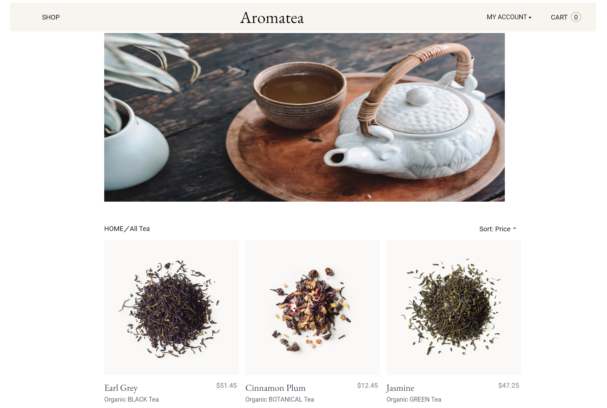
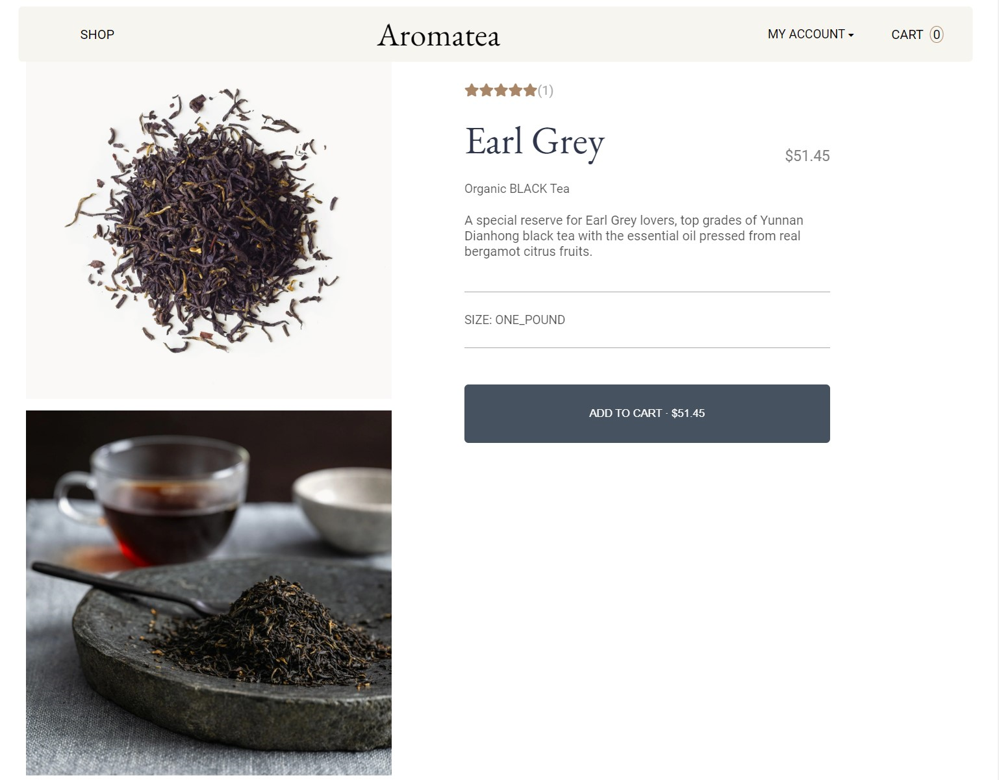
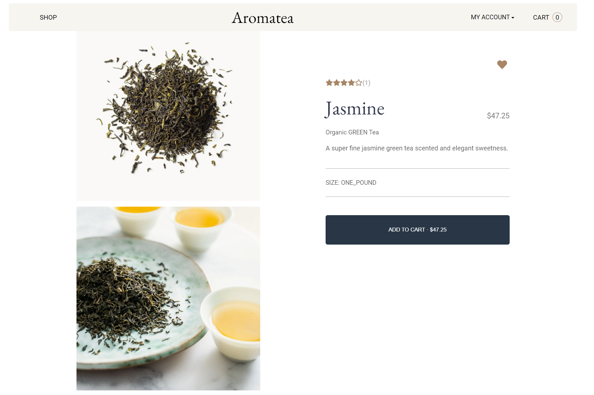

# Aromatea

Aromatea is a refined e-commerce platform inspired by Rishi Tea. This project offers a seamless and enriching user experience, allowing tea enthusiasts to explore, discover, and purchase high-quality, authentic teas with ease.

## Live site: [Aromatea](https://capstone-79jg.onrender.com)

## Index
[Database Schema](https://github.com/Vivi355/Aromatea/wiki/Database-Schema) |
[User Stories](https://github.com/Vivi355/Aromatea/wiki/User-Stories-and-Future-Implementations) |
[Wireframes](https://github.com/Vivi355/Aromatea/wiki/Wireframes) |

## Tech Stack

## Products Page

## Product Detail Page
<!--  -->

## Getting started
1. Clone this repository:

   * `
   https://github.com/Vivi355/Aromatea.git
   `
2. Install dependencies into the Backend by running the following:
    * `pipenv install`

3. Install dependencies into the Frontend by cd into `react-app` and running the following:
    * `npm install`

4. Create a **.env** file using the **.envexample** provided

5. Set up your database with information from your .env and then run the following to create your database, migrate, and seed:
    * `pipenv run flask db migrate`
    * `pipenv run flask db upgrade`
    * `pipenv run flask seed all`

6. Start the app for backend using:
    * `pipenv run flask run`

7. Start the app for frontend by cd into `react-app` and running:
    * `npm start`

8. Now you can use the `Demo User` button from the login page to log in or Create an account

***

# Feature List

## Products
* Users can read/view all Products
* Logged-in Users can create a Product
* Logged-in Users can update their Product
* Logged-in Users can delete their Product

## Cart
* Users can read/view all items in their Cart
* Logged-in Users can add products to their Cart
* Logged-in Users can edit the quantity of the item in their Cart
* Logged-in Users can delete item from their Cart

## Review
* Users can read/review all Reviews on a Product
* Logged-in Users can create Review on a Product
* Logged-in Users can edit Review on a Product
* Logged-in Users can delete their Review on a Product

## Wishlist
* Logged-in Users can read/view their Wishlists
* Logged-in Users can add Products to their Wishlist
* Logged-in Users can delete Products from their Wishlist

## AWS
* Logged-in Users can upload multiple images of their Products to AWS S3

***

# Future Implementation Goals

1. Search Bar

***

# Connect
* [GitHub](https://github.com/Vivi355)
* [LinkedIn](https://www.linkedin.com/in/liqin-li-880646144/)
